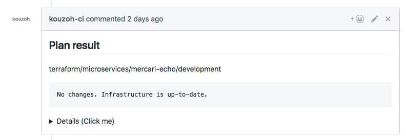
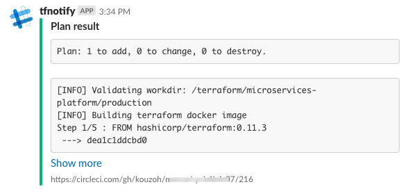
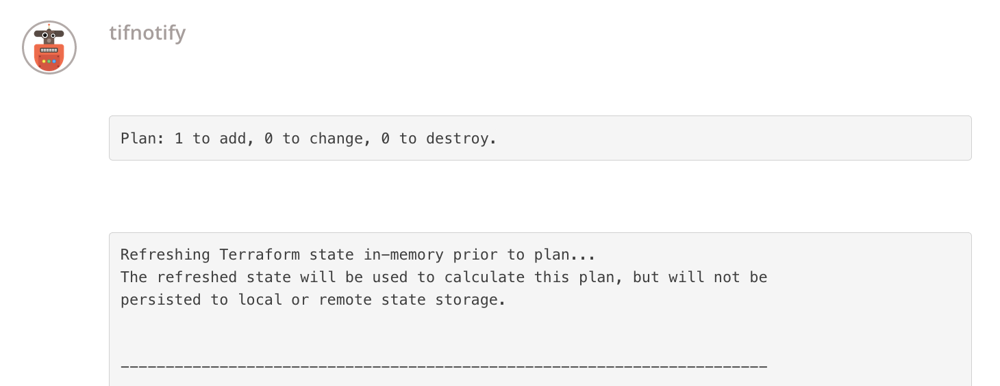
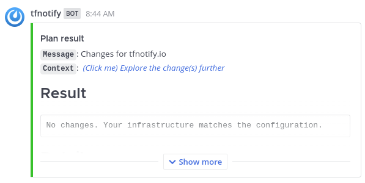

tfnotify
========

[![][release-svg]][release] [![][test-svg]][test] [![][goreportcard-svg]][goreportcard]

[release]: https://github.com/mercari/tfnotify/actions?query=workflow%3Arelease
[release-svg]: https://github.com/mercari/tfnotify/workflows/release/badge.svg
[test]: https://github.com/mercari/tfnotify/actions?query=workflow%3Atest
[test-svg]: https://github.com/mercari/tfnotify/workflows/test/badge.svg
[goreportcard]: https://goreportcard.com/report/github.com/mercari/tfnotify
[goreportcard-svg]: https://goreportcard.com/badge/github.com/mercari/tfnotify

tfnotify parses Terraform commands' execution result and applies it to an arbitrary template and then notifies it to GitHub comments etc.

## Motivation

There are commands such as `plan` and `apply` on Terraform command, but many developers think they would like to check if the execution of those commands succeeded.
Terraform commands are often executed via CI like Circle CI, but in that case you need to go to the CI page to check it.
This is very troublesome. It is very efficient if you can check it with GitHub comments or Slack etc.
You can do this by using this command.









## Installation

Grab the binary from GitHub Releases (Recommended)

or

```console
$ go get -u github.com/mercari/tfnotify
```


### What tfnotify does

1. Parse the execution result of Terraform
2. Bind parsed results to Go templates
3. Notify it to any platform (e.g. GitHub) as you like

Detailed specifications such as templates and notification destinations can be customized from the configuration files (described later).

## Usage

### Basic

tfnotify is just CLI command. So you can run it from your local after grabbing the binary.

Basically tfnotify waits for the input from Stdin. So tfnotify needs to pipe the output of Terraform command like the following:

```console
$ terraform plan | tfnotify plan
```

For `plan` command, you also need to specify `plan` as the argument of tfnotify. In the case of `apply`, you need to do `apply`. Currently supported commands can be checked with `tfnotify --help`.

### Configurations

When running tfnotify, you can specify the configuration path via `--config` option (if it's omitted, it defaults to `{.,}tfnotify.y{,a}ml`).

The example settings of GitHub and GitHub Enterprise, Slack, [Typetalk](https://www.typetalk.com/) are as follows. Incidentally, there is no need to replace TOKEN string such as `$GITHUB_TOKEN` with the actual token. Instead, it must be defined as environment variables in CI settings.

[template](https://golang.org/pkg/text/template/) of Go can be used for `template`. The templates can be used in `tfnotify.yaml` are as follows:

Placeholder | Usage
---|---
`{{ .Title }}` | Like `## Plan result`
`{{ .Message }}` | A string that can be set from CLI with `--message` option
`{{ .Result }}` | Matched result by parsing like `Plan: 1 to add` or `No changes`
`{{ .Body }}` | The entire of Terraform execution result
`{{ .Link }}` | The link of the build page on CI

On GitHub, tfnotify can also put a warning message if the plan result contains resource deletion (optional).

#### Template Examples

<details>
<summary>For GitHub</summary>

```yaml
---
ci: circleci
notifier:
  github:
    token: $GITHUB_TOKEN
    repository:
      owner: "mercari"
      name: "tfnotify"
terraform:
  fmt:
    template: |
      {{ .Title }}

      {{ .Message }}

      {{ .Result }}

      {{ .Body }}
  plan:
    template: |
      {{ .Title }} <sup>[CI link]( {{ .Link }} )</sup>
      {{ .Message }}
      {{if .Result}}
      <pre><code>{{ .Result }}
      </pre></code>
      {{end}}
      <details><summary>Details (Click me)</summary>

      <pre><code>{{ .Body }}
      </pre></code></details>
  apply:
    template: |
      {{ .Title }}
      {{ .Message }}
      {{if .Result}}
      <pre><code>{{ .Result }}
      </pre></code>
      {{end}}
      <details><summary>Details (Click me)</summary>

      <pre><code>{{ .Body }}
      </pre></code></details>
```

If you would like to let tfnotify warn the resource deletion, add `when_destroy` configuration as below.

```yaml
---
# ...
terraform:
  # ...
  plan:
    template: |
      {{ .Title }} <sup>[CI link]( {{ .Link }} )</sup>
      {{ .Message }}
      {{if .Result}}
      <pre><code>{{ .Result }}
      </pre></code>
      {{end}}
      <details><summary>Details (Click me)</summary>

      <pre><code>{{ .Body }}
      </pre></code></details>
    when_destroy:
      template: |
        ## :warning: WARNING: Resource Deletion will happen :warning:

        This plan contains **resource deletion**. Please check the plan result very carefully!
  # ...
```

You can also let tfnotify add a label to PRs depending on the `terraform plan` output result. Currently, this feature is for Github labels only.

```yaml
---
# ...
terraform:
  # ...
  plan:
    template: |
      {{ .Title }} <sup>[CI link]( {{ .Link }} )</sup>
      {{ .Message }}
      {{if .Result}}
      <pre><code>{{ .Result }}
      </pre></code>
      {{end}}
      <details><summary>Details (Click me)</summary>

      <pre><code>{{ .Body }}
      </pre></code></details>
    when_add_or_update_only:
      label: "add-or-update"
    when_destroy:
      label: "destroy"
    when_no_changes:
      label: "no-changes"
    when_plan_error:
      label: "error"
  # ...
```

Sometimes you may want not to HTML-escape Terraform command outputs.
For example, when you use code block to print command output, it's better to use raw characters instead of character references (e.g. `-/+` -> `-/&#43;`, `"` -> `&#34;`).

You can disable HTML escape by adding `use_raw_output: true` configuration.
With this configuration, Terraform doesn't HTML-escape any Terraform output.

~~~yaml
---
# ...
terraform:
  use_raw_output: true
  # ...
  plan:
    template: |
      {{ .Title }} <sup>[CI link]( {{ .Link }} )</sup>
      {{ .Message }}
      {{if .Result}}
      ```
      {{ .Result }}
      ```
      {{end}}
      <details><summary>Details (Click me)</summary>

      ```
      {{ .Body }}
      ```
  # ...
~~~

</details>

<details>
<summary>For GitHub Enterprise</summary>

```yaml
---
ci: circleci
notifier:
  github:
    token: $GITHUB_TOKEN
    base_url: $GITHUB_BASE_URL # Example: https://github.example.com/api/v3
    repository:
      owner: "mercari"
      name: "tfnotify"
terraform:
  fmt:
    template: |
      {{ .Title }}

      {{ .Message }}

      {{ .Result }}

      {{ .Body }}
  plan:
    template: |
      {{ .Title }} <sup>[CI link]( {{ .Link }} )</sup>
      {{ .Message }}
      {{if .Result}}
      <pre><code>{{ .Result }}
      </pre></code>
      {{end}}
      <details><summary>Details (Click me)</summary>

      <pre><code>{{ .Body }}
      </pre></code></details>
  apply:
    template: |
      {{ .Title }}
      {{ .Message }}
      {{if .Result}}
      <pre><code>{{ .Result }}
      </pre></code>
      {{end}}
      <details><summary>Details (Click me)</summary>

      <pre><code>{{ .Body }}
      </pre></code></details>
```

</details>

<details>
<summary>For GitLab</summary>

```yaml
---
ci: gitlabci
notifier:
  gitlab:
    token: $GITLAB_TOKEN
    base_url: $GITLAB_BASE_URL
    repository:
      owner: "mercari"
      name: "tfnotify"
terraform:
  fmt:
    template: |
      {{ .Title }}

      {{ .Message }}

      {{ .Result }}

      {{ .Body }}
  plan:
    template: |
      {{ .Title }} <sup>[CI link]( {{ .Link }} )</sup>
      {{ .Message }}
      {{if .Result}}
      <pre><code> {{ .Result }}
      </pre></code>
      {{end}}
      <details><summary>Details (Click me)</summary>
      <pre><code> {{ .Body }}
      </pre></code></details>
  apply:
    template: |
      {{ .Title }}
      {{ .Message }}
      {{if .Result}}
      <pre><code> {{ .Result }}
      </pre></code>
      {{end}}
      <details><summary>Details (Click me)</summary>
      <pre><code> {{ .Body }}
      </pre></code></details>
```
</details>


<details>
<summary>For Mattermost</summary>

```yaml
---
ci: circleci
notifier:
  mattermost:
    webhook: $MATTERMOST_WEBHOOK
    channel: $MATTERMOST_CHANNEL
    bot: $MATTERMOST_BOT_NAME
terraform:
  fmt:
    template: |
      {{if .Message}}**`Message`**: {{ .Message }}{{end}}
      **`Context`**:  [*(Click me) Explore the change(s) further*]( {{ .Link }} )
      
      {{if .Result}}
      ## Result
      ```
      {{ .Result }}
      ```
      {{end}}

      ## Details

      View the summary below

      ```
      {{ .Body }}
      ```

  plan:
    template: |
      {{if .Message}}**`Message`**: {{ .Message }}{{end}}
      **`Context`**:  [*(Click me) Explore the change(s) further*]( {{ .Link }} )
      
      {{if .Result}}
      ## Result
      ```
      {{ .Result }}
      ```
      {{end}}

      ## Details

      View the summary below

      ```
      {{ .Body }}
      ```
  
    when_destroy:
      template: |
        ## :warning: WARNING: Resource Deletion will happen :warning:

        This plan contains **resource deletion**. Please check the plan result very carefully!
  apply:
    template: |
      {{if .Message}}**`Message`**: {{ .Message }}{{end}}
      **`Context`**:  [*(Click me) Explore the change(s) further*]( {{ .Link }} )
      
      {{if .Result}}
      ## Result
      ```
      {{ .Result }}
      ```
      {{end}}

      ## Details

      View the summary below

      ```
      {{ .Body }}
      ```
```

> Note, for `notifier.mattermost.bot` to work override, you must ensure you enable application/ webhook overrides on your Mattermost system. If you do not, the webhook will, by default, take the name of its creator. If you cannot enable application/ webhook overrides, you might have to consider creating a dedicated `tfnotify` Mattermost user account.

</details>

<details>
<summary>For Slack</summary>

```yaml
---
ci: circleci
notifier:
  slack:
    token: $SLACK_TOKEN
    channel: $SLACK_CHANNEL_ID
    bot: $SLACK_BOT_NAME
terraform:
  plan:
    template: |
      {{ .Message }}
      {{if .Result}}
      ```
      {{ .Result }}
      ```
      {{end}}
      ```
      {{ .Body }}
      ```
```

Sometimes you may want not to HTML-escape Terraform command outputs.
For example, when you use code block to print command output, it's better to use raw characters instead of character references (e.g. `-/+` -> `-/&#43;`, `"` -> `&#34;`).

You can disable HTML escape by adding `use_raw_output: true` configuration.
With this configuration, Terraform doesn't HTML-escape any Terraform output.

~~~yaml
---
# ...
terraform:
  use_raw_output: true
  # ...
  plan:
  # ...
~~~

</details>

<details>
<summary>For Typetalk</summary>

```yaml
---
ci: circleci
notifier:
  typetalk:
    token: $TYPETALK_TOKEN
    topic_id: $TYPETALK_TOPIC_ID
terraform:
  plan:
    template: |
      {{ .Message }}
      {{if .Result}}
      ```
      {{ .Result }}
      ```
      {{end}}
      ```
      {{ .Body }}
      ```
```

</details>

### Supported CI

Currently, supported CI are here:

- Circle CI
- Travis CI
- AWS CodeBuild
- TeamCity
- Drone
- Jenkins
- GitLab CI
- GitHub Actions
- Google Cloud Build

### Private Repository Considerations
GitHub private repositories require the `repo` and `write:discussion` permissions.

### Jenkins Considerations
- Plugin
  - [Git Plugin](https://wiki.jenkins.io/display/JENKINS/Git+Plugin)
- Environment Variable
  - `PULL_REQUEST_NUMBER` or `PULL_REQUEST_URL` are required to set by user for Pull Request Usage

### Google Cloud Build Considerations

- These environment variables are needed to be set using [substitutions](https://cloud.google.com/cloud-build/docs/configuring-builds/substitute-variable-values)
  - `COMMIT_SHA`
  - `BUILD_ID`
  - `PROJECT_ID`
  - `_PR_NUMBER`
  - `_REGION`
- Recommended trigger events
  - `terraform plan`: Pull request
  - `terraform apply`: Push to branch

## Committers

 * Masaki ISHIYAMA ([@b4b4r07](https://github.com/b4b4r07))

## Contribution

Please read the CLA below carefully before submitting your contribution.

https://www.mercari.com/cla/

## License

Copyright 2018 Mercari, Inc.

Licensed under the MIT License.
